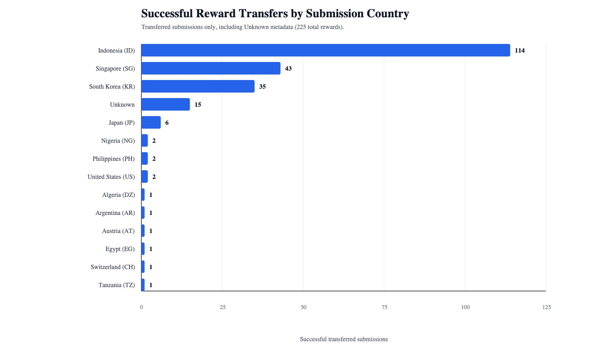
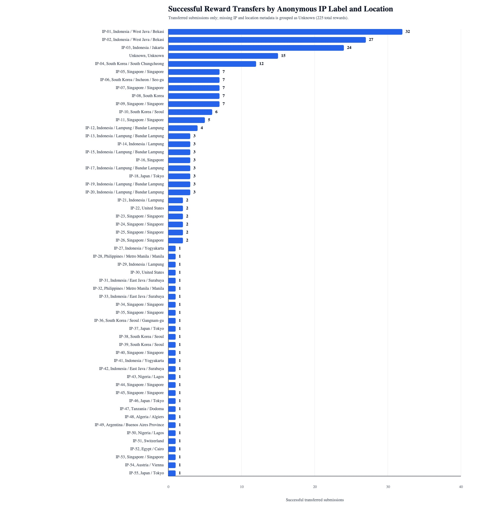

# Tonnel Airdrop Event Report

Prepared on June 4, 2026

Event period: May 21, 2026 to May 31, 2026

## Table of Contents

1. [Executive Summary](#executive-summary)
2. [Event Outcome](#event-outcome)
3. [Participation Analysis](#participation-analysis)
4. [Airdrop Execution Method](#airdrop-execution-method)
5. [Positive Findings](#positive-findings)
6. [Limitations](#limitations)
7. [Promotion Plan](#promotion-plan)
8. [Conference Opportunities](#conference-opportunities)
9. [Indonesian Community Targets](#indonesian-community-targets)
10. [Related Project Updates](#related-project-updates)
11. [Conclusion](#conclusion)
12. [Sources](#sources)

## Executive Summary

The Tonnel airdrop event has ended. It ran from May 21, 2026 to May 31, 2026 and rewarded users who completed a real private-state transfer inside Tonnel and submitted the qualifying transaction hash through the public airdrop site.

The campaign confirmed meaningful demand for a privacy-oriented on-chain product, especially in Indonesia. The strongest signal came from the exported successful-transfer data: Indonesia represented 114 of 225 successful reward transfers, or 50.7% of all successful transfers shown in the campaign histogram. Singapore and South Korea followed with 43 and 35 successful transfers respectively.

The main limitation was distribution. Promotion was not broad enough, which allowed a relatively small set of highly active users to capture a significant share of rewards. The primary improvement for the next event is therefore not a heavier eligibility system, but a much stronger promotion campaign that brings more real participants into the funnel before reward exhaustion.

## Event Outcome

| Item | Result |
| --- | --- |
| Event status | Ended |
| Campaign period | May 21, 2026 to May 31, 2026 |
| Product introduced | Tonnel, the public name for `the-great-first-channel`, a Tokamak Private App Channel |
| User action rewarded | A valid private-state transfer-notes transaction in Tonnel |
| Public submission input | Transaction hash only |
| Base reward rule implemented in the app | 25 TON per valid submission |
| Successful transfers shown in exported histograms | 225 |
| Strongest regional signal | Indonesia |

## Participation Analysis

### Successful Reward Transfers By Country

The country histogram shows that participation was highly concentrated in Southeast and East Asia.

| Country or region | Successful transfers | Share of 225 successful transfers |
| --- | ---: | ---: |
| Indonesia | 114 | 50.7% |
| Singapore | 43 | 19.1% |
| South Korea | 35 | 15.6% |
| Unknown metadata | 15 | 6.7% |
| Japan | 6 | 2.7% |
| Other countries combined | 12 | 5.3% |

Indonesia was the clear standout. This matters commercially because Indonesia combines a large retail crypto base, active Telegram usage, and strong regional event infrastructure such as Coinfest Asia. The result suggests that Indonesia should be treated as a primary go-to-market region rather than a secondary community target.

South Korea also produced meaningful activity. A market-side discussion with blockchain marketing experience indicated that Korean coin traders often use Telegram more actively than X for project discovery and community coordination. This aligns with the campaign's broader lesson: crypto-native Telegram communities should be treated as a core distribution channel, not merely a support channel.

### Successful Reward Transfers By Anonymous IP Label And Location

The anonymous IP-label histogram shows concentration at the participant-cluster level. The top three labels are all from Indonesia and account for 83 successful transfers:

| Anonymous label | Location metadata | Successful transfers |
| --- | --- | ---: |
| IP-01 | Indonesia / West Java / Bekasi | 32 |
| IP-02 | Indonesia / West Java / Bekasi | 27 |
| IP-03 | Indonesia / Jakarta | 24 |

Those three labels represent 36.9% of all successful reward transfers in the exported data. This does not by itself prove improper activity, because the labels are anonymous and location/IP metadata can group multiple legitimate users behind shared networks. However, it clearly shows that participation was not broadly distributed enough.

The conclusion is operational: the next event should start with stronger promotion before and during the event window, so that demand is distributed across more communities, more geographies, and more discovery channels.

## Airdrop Execution Method

The repository implements a lean public airdrop system rather than a heavy campaign-management platform. The event workflow was concrete and auditable:

| Stage | How it worked |
| --- | --- |
| Public landing page | Users received a clear explanation of Tonnel, the reward rule, winner criteria, safety warnings, and participation steps. |
| Guided participation | The app guided users to use the `@tokamak-private-dapps/private-state-cli` package, join Tonnel, make a private-state transfer, and submit the resulting transaction hash. |
| Minimal submission | Users submitted only a transaction hash. The public form did not ask for private keys or wallet secrets. |
| Format validation | The API rejected invalid transaction-hash formats before saving them. |
| Duplicate transaction handling | If the same transaction hash was submitted again, the API returned the existing application instead of creating a second claim. |
| Verification | A local worker checked the transaction through Ethereum RPC, confirmed it succeeded, confirmed it called the Tonnel channel manager, decoded the channel transaction, and verified that it was a private-state transfer-notes action. |
| Participant resolution | The worker resolved the Ethereum submitter and the registered Tonnel channel address for payout. |
| Payout | Valid submissions were paid by the local operator worker using the private-state CLI. Server-side public payout execution was intentionally disabled. |
| Status visibility | Participants could check whether a submission was pending, transferred, or failed. Later UI updates made failure reasons easier to understand. |
| Operator analytics | Internal analytics grouped submissions by hashed IP metadata, user-agent metadata, Ethereum wallet, Tonnel channel address, country, region, and city. This produced the histograms used in this report. |
| Worker operations | The worker ran from a launchd-installed runtime outside the macOS Documents directory, waited for network availability, and sent alerts for every worker run. |

The campaign was improved continuously during the event. Notable operational changes included rate-limit tuning, mobile layout fixes, clearer status messages, better status tooltips, worker retries for stale workspace failures, reward-budget exhaustion classification, invalid-transaction classification, and exported participation histograms.

## Positive Findings

### Indonesia Was More Active Than Expected

Indonesia accounted for the majority of successful reward transfers in the exported country data. This is a valuable go-to-market signal for Tonnel because it shows that the product can attract users outside the initial Korean and Singapore-centered network.

### Telegram Should Be Treated As A Primary Channel

The campaign reinforced that Telegram is a strong project-promotion channel in crypto markets. For Korean traders in particular, experienced blockchain marketing feedback indicated that Telegram can be more important than X for trader discovery, group discussion, and real-time community trust.

### UX And Operations Improved During The Campaign

The product improved materially while the event was live. The application moved toward clearer user guidance, better mobile presentation, more understandable status messages, more visible failure reasons, and better worker monitoring. The related `tokamak-zk-evm-contracts` updates described later in this report are part of the same improvement story: private-state CLI releases, safer dry-runs, structured machine-readable output, clearer recovery guidance, AI-agent instructions, and investor-facing educational materials made the Tonnel user journey and operating model easier to explain, automate, and support. Together, these improvements reduce future support load and make the next campaign easier to scale.

## Limitations

The campaign's main weakness was insufficient promotion. Because the audience was not broad enough, a limited number of highly active participants captured a large amount of the reward pool. The data shows this at both the country level and anonymous participant-cluster level.

No broader mitigation is proposed here beyond stronger promotion. The highest-value correction is to increase the number of real participants reached before launch, especially through Indonesia-focused communities, Telegram groups, Reddit discussion surfaces, and developer/business conferences.

## Promotion Plan

The next campaign should be planned as a distribution campaign first and a reward campaign second.

| Target | Reason | Suggested approach |
| --- | --- | --- |
| Indonesian communities | Indonesia produced the strongest participation signal. | Start outreach before launch through Indonesian crypto, blockchain, builder, and trader communities. |
| Telegram | Telegram appears to be a high-conversion channel for crypto-native audiences. | Prepare official posts, community manager coverage, local-language FAQs, and partner AMAs. |
| Reddit | Reddit is useful for longer-form explanation, public discussion, and search-indexed discovery. | Use Ethereum, privacy, developer, and crypto-trading subreddits where rules permit project discussion. |
| Tech and business conferences | Conferences provide credibility, partner discovery, and investor-facing visibility. | Prioritize Ethereum developer events for builders and business conferences for exchanges, funds, and ecosystem partners. |

## Conference Opportunities

The following events are relevant for promotion, partnerships, developer adoption, investor visibility, or community development. Dates should be reconfirmed before booking because event programs can change. Sources were checked on June 4, 2026.

| Event | Date | Location | Type | Investor relevance | Source |
| --- | --- | --- | --- | --- | --- |
| ETHis | July 2-3, 2026 | Munich, Germany | Ethereum real-world summit | Good fit for explaining Tonnel as Ethereum-settled private application infrastructure to builders and operators. | [ETHis](https://www.ethis.xyz/), [ethereum.org events](https://ethereum.org/community/events/conferences/) |
| Pragma Lisbon | July 23, 2026 | Lisbon, Portugal | Ethereum conference | Concentrated Ethereum founder and protocol audience before the Lisbon hackathon. | [ETHGlobal](https://ethglobal.com/), [ethereum.org events](https://ethereum.org/community/events/conferences/) |
| ETHGlobal Lisbon | July 24-26, 2026 | Lisbon, Portugal | Ethereum hackathon | Strong developer acquisition opportunity for privacy, wallet, and agent-assisted workflows. | [ETHGlobal](https://ethglobal.com/) |
| Coinfest Asia | August 20-21, 2026 | Bali, Indonesia | Crypto, Web3, builders, traders, institutions | Highest-priority regional event because the airdrop data showed strong Indonesian participation and the event explicitly serves builders, traders, and institutions. | [Coinfest Asia](https://coinfest.asia/) |
| ETHSafari | September 1-6, 2026 | Kenya | Ethereum conference and hackathon | Useful for emerging-market Ethereum community expansion and developer relations. | [ethereum.org events](https://ethereum.org/community/events/conferences/) |
| ETHTaipei | September 11-15, 2026 | Taipei, Taiwan | Ethereum conference | Relevant for Asia-based Ethereum developers and protocol communities. | [ethereum.org events](https://ethereum.org/community/events/conferences/) |
| European Blockchain Convention | September 16-17, 2026 | Barcelona, Spain | Blockchain business conference | Business-development venue for partnerships, institutional narratives, and ecosystem visibility. | [ethereum.org events](https://ethereum.org/community/events/conferences/) |
| ETHSofia | September 24, 2026 | Sofia, Bulgaria | Ethereum builder and institutional conference | Targets Ethereum builders, researchers, privacy infrastructure teams, and institutions. | [ETHSofia](https://www.ethsofia.com/) |
| Pragma Tokyo | September 24, 2026 | Tokyo, Japan | Ethereum conference | Strong pre-hackathon ecosystem access in Japan. | [ethereum.org events](https://ethereum.org/community/events/conferences/) |
| ETHGlobal Tokyo | September 25-27, 2026 | Tokyo, Japan | Ethereum hackathon | Developer acquisition and product feedback opportunity in a major Asian market. | [ethereum.org events](https://ethereum.org/community/events/conferences/) |
| Korea Blockchain Week | September 29-October 1, 2026 | Seoul, South Korea | Digital asset business conference | Relevant for Korean traders, institutions, exchanges, and Telegram-led promotion networks. | [KBW announcement](https://www.prnewswire.com/news-releases/kbw-2026-returns-to-seoul-september-29october-1-upbit-joins-as-main-sponsor-302660025.html) |
| TOKEN2049 Singapore | October 7-8, 2026 | Singapore | Global crypto business conference | Major investor, exchange, market-maker, and ecosystem partner venue; includes startup and hackathon programs. | [TOKEN2049 Singapore](https://www.token2049.com/singapore) |
| Devcon India | November 3-6, 2026 | Mumbai, India | Ethereum global community and developer conference | Flagship Ethereum developer event; best 2026 venue for serious Ethereum ecosystem positioning. | [Devcon](https://devcon.org/), [ethereum.org events](https://ethereum.org/community/events/conferences/) |
| Pragma Mumbai | November 5, 2026 | Mumbai, India | Ethereum conference | Focused Ethereum networking during Devcon week. | [ethereum.org events](https://ethereum.org/community/events/conferences/) |
| ETHGlobal Mumbai | November 6-8, 2026 | Mumbai, India | Ethereum hackathon | Strong follow-on developer acquisition after Devcon. | [ethereum.org events](https://ethereum.org/community/events/conferences/) |
| DC Blockchain Summit | April 6-7, 2027 | Washington, DC, USA | Policy and business summit | Useful for policy, institutional, and regulated digital-asset conversations. | [DC Blockchain Summit](https://www.dcblockchainsummit.com/) |
| EthCC | April 12-15, 2027 | Cannes, France | Ethereum community conference | Largest long-running European Ethereum conference; strong for developer credibility and ecosystem partnerships. | [Palais des Festivals](https://en.palaisdesfestivals.com/offers/ethereum-community-conference-cannes-en-5198662/) |
| TOKEN2049 Dubai | April 21-22, 2027 | Dubai, UAE | Global crypto business conference | High-density investor and executive access; official site lists 15,000+ attendees and 4,000+ companies. | [TOKEN2049 Dubai](https://www.token2049.com/dubai) |

## Indonesian Community Targets

The following communities are relevant for the next campaign because they are Indonesian, crypto/blockchain-oriented, or trader/developer-oriented. Community quality and promotion terms should be checked directly before any paid or official campaign.

| Community | Primary channel | Audience | Why it matters | Source |
| --- | --- | --- | --- | --- |
| Official Ethereum Meetup Indonesia | Telegram | Ethereum community | Ethereum-specific Indonesian channel; useful for technically aligned outreach. | [Telegram @ethereum_indo](https://t.me/ethereum_indo) |
| BlockDevId | Telegram, Discord, Luma, events | Indonesian Web3 developers and builders | Developer-focused community with 15K+ members claimed on its site, 100+ events, workshops, hackathons, and builder programs. | [BlockDevId](https://blockdev.id/), [Luma](https://luma.com/BlockDev) |
| Asosiasi Blockchain Indonesia | Website, industry network | Blockchain companies, policy, industry stakeholders | National blockchain association; useful for legitimacy, policy context, and ecosystem partnerships. | [ABI](https://asosiasiblockchain.co.id/?RefID=Livetweets) |
| ABI-Aspakrindo & Friends | Telegram | Blockchain and crypto-asset industry network | Public industry report lists a Telegram community for ABI and Aspakrindo contacts. | [Indonesia Crypto & Web3 Industry Report](https://asosiasiblockchain.co.id/2024_Indonesia%20Crypto_%26_Web3_Industry_Report.pdf) |
| Indonesia Crypto Network / Coinfest Asia | Event and community network | Indonesian and regional crypto builders, traders, institutions | Organizer ecosystem around Indonesia's largest crypto festival; directly aligned with the strongest airdrop region. | [Coinfest Asia](https://coinfest.asia/) |
| Tokocrypto Official Channel | Telegram | Indonesian exchange users and crypto traders | Large Indonesian exchange-related channel; public directory lists over 37K subscribers. | [Telegram directory](https://telegramgroups.co/channel/tokocryptoexchange) |
| Cryptocium | Telegram | Indonesian crypto traders and community members | Public directory describes it as one of Indonesia's biggest crypto communities and lists over 72K members. | [Nicegram directory](https://nicegram.app/hub/group/cryptocium) |
| Komunitas Crypto / Kotas Crypto | Telegram | Indonesian crypto traders | Public directory describes it as a crypto community sharing technical-analysis insights and covering Bitcoin, Ethereum, and DeFi. | [Telemetr](https://telemetr.io/en/channels/2144899709-kotascrypto) |
| Cryptorize Indonesia | Telegram | Indonesian crypto community | Public directory describes it as a crypto society with a group chat and partnership contact. | [Telemetr](https://telemetr.io/en/channels/2097147429-cryptorize_id) |
| Pejuang Crypto Indonesia | Telegram, Instagram | Indonesian crypto and blockchain learners | Community partner profile says it was founded in 2021 and has more than 9,800 regular members. | [Kommunitas docs](https://docs.kommunitas.net/partnership-1/community-partner/community-partner/pejuang-crypto-indonesia) |
| IDNTRADE Community | Telegram, Discord, Zoom | Indonesian crypto traders | Trader education community using Telegram and Discord, with weekly Zoom webinars. | [IDNTRADE](https://idntrade.org/komunitas) |
| Sui Indonesia | Telegram, X, Luma | Indonesian blockchain users, developers, and ecosystem participants | Not Ethereum-specific, but it is an active Indonesian blockchain community with events and real-time Telegram discussion. | [Sui Indonesia](https://suiindonesia.com/) |

## Related Project Updates

The related `tokamak-zk-evm-contracts` repository changed materially between May 21, 2026 and June 4, 2026. The updates are grouped below by subject rather than by date.

### Easier And Safer Private-State CLI Usage

The private-state CLI moved through releases up to version 2.4.3. The practical effect is that users and AI agents now receive clearer instructions, cleaner outputs, and better error messages when they run Tonnel-related commands.

For non-technical users, this matters because the command-line tool is the bridge between a user and the private-state product. If the tool explains what went wrong in plain terms, users are less likely to abandon the flow or ask for manual support.

### Fewer Failed Transactions Before Submission

The CLI added pre-submit dry-runs for transaction-sending commands. In plain language, the tool can now rehearse a transaction locally before asking the blockchain to execute it. If the transaction is likely to fail, the user can see the issue before paying for a failed on-chain attempt.

This is important for future airdrops because the rewarded action requires a real private-state transfer. A smoother transaction path should improve completion rates and reduce user frustration.

### More Reliable Machine-Readable Output

The CLI standardized JSON output and added structured JSON errors. This means applications, scripts, and AI agents can read the CLI's final result more reliably instead of guessing from human-readable terminal text.

For Tonnel, this supports a better automated experience: the website, worker, analytics, and agent-assisted instructions can be connected with fewer fragile assumptions.

### Better Recovery When Local State Is Out Of Date

Private-state usage depends on local workspace data that mirrors channel state. Several updates improved how the CLI detects stale channel data, gives recovery guidance, and uses workspace mirrors before falling back to heavier rebuilds.

For users, the simple version is: when the local copy of Tonnel state is old, the tool is better at telling the user how to refresh it and better at avoiding unnecessary failed transactions.

### Clearer Guidance For AI-Assisted Users

The CLI documentation and package-shipped agent guidance were updated so AI agents can help users more safely. This matters because the airdrop flow explicitly used agent-assisted participation: users could ask an AI agent to install the CLI, join Tonnel, make the qualifying transfer, and return the transaction hash.

Better agent guidance reduces ambiguity and keeps sensitive-key warnings visible.

### More Accurate Fee And Join-Toll Explanations

Documentation clarified that a channel join toll is paid directly from the L1 wallet, while bridge deposits are for later channel liquidity. Fee-estimate guidance was also clarified.

This makes onboarding easier because users can understand which payments are required, why they are required, and where they come from.

### Stronger Educational Materials For Partners And Investors

The contracts repository added and refined a private app channels bridge deck. The deck explains the system model, privacy purpose, trust assumptions, state transitions, DApp and channel policy concepts, verifier responsibilities, and related resources.

For investors, this is meaningful because it turns the underlying technology into a clearer narrative: Tonnel is not only an airdrop page, but a demonstration of private application state running inside an Ethereum-settled channel model.

## Conclusion

The event demonstrated real user interest in Tonnel, with Indonesia emerging as the most important immediate market signal. The implementation worked as a focused end-to-end campaign system: public instructions, transaction-hash submission, local verification, private-state payout, status visibility, and operator analytics.

The key lesson is distribution. The next event should be promoted more aggressively through Indonesian communities, Telegram, Reddit, and selected Ethereum/blockchain conferences so that participation is broader before rewards are consumed.

## Sources

- Local repository implementation and commits: `Tokamak-zk-EVM-airdrop`
- Related repository commits and changelog: `/Users/jehyuk/Documents/repo/tokamak-zk-evm-contracts`
- Ethereum event list: https://ethereum.org/community/events/conferences/
- ETHGlobal: https://ethglobal.com/
- Devcon: https://devcon.org/
- Coinfest Asia: https://coinfest.asia/
- Korea Blockchain Week announcement: https://www.prnewswire.com/news-releases/kbw-2026-returns-to-seoul-september-29october-1-upbit-joins-as-main-sponsor-302660025.html
- TOKEN2049 Singapore: https://www.token2049.com/singapore
- TOKEN2049 Dubai: https://www.token2049.com/dubai
- ETHSofia: https://www.ethsofia.com/
- DC Blockchain Summit: https://www.dcblockchainsummit.com/
- EthCC venue listing: https://en.palaisdesfestivals.com/offers/ethereum-community-conference-cannes-en-5198662/
- BlockDevId: https://blockdev.id/
- Official Ethereum Meetup Indonesia Telegram: https://t.me/ethereum_indo
- Asosiasi Blockchain Indonesia: https://asosiasiblockchain.co.id/?RefID=Livetweets
- Sui Indonesia: https://suiindonesia.com/
- IDNTRADE community: https://idntrade.org/komunitas
- Pejuang Crypto Indonesia community profile: https://docs.kommunitas.net/partnership-1/community-partner/community-partner/pejuang-crypto-indonesia
